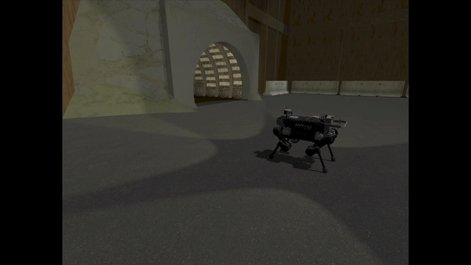

# CERBERUS ANYmal Locomotion
This repository contains the software that can be used to control the ANYmal model in the  [DARPA Subterranean Challenge Virtual Competition Simulator](https://github.com/osrf/subt/wiki).

**Authors & Maintainers**:
  * Samuel Zimmermann
  * Marco Tranzatto
  * Timon Homberger

**Affiliation:** [Robotic Systems Lab - ETH Zurich](https://rsl.ethz.ch/the-lab.html)

### ANYmal B
[](doc/cerberus_anymal_b.gif)

### ANYmal C
[](doc/cerberus_anymal_c.gif)

## License
This software is released under a [BSD 3-Clause license](LICENSE).

## Publications
If you use this work in an academic context, please cite the following publications:

> Joonho Lee,  Jemin Hwangbo,  Lorenz Wellhausen,  Vladlen Koltun and Marco Hutter
> **"Learning quadrupedal locomotion over challenging terrain"**,
> in Science Robotics, 21.10, 2020 ([DOI](https://robotics.sciencemag.org/content/5/47/eabc5986))

    @article{Leeeabc5986,
  	    author = {Lee, Joonho and Hwangbo, Jemin and Wellhausen, Lorenz and Koltun, Vladlen and Hutter, Marco},
      	title = {Learning quadrupedal locomotion over challenging terrain},
      	volume = {5},
      	number = {47},
      	elocation-id = {eabc5986},
      	year = {2020},
      	doi = {10.1126/scirobotics.abc5986},
      	publisher = {Science Robotics},
      	URL = {https://robotics.sciencemag.org/content/5/47/eabc5986},
      	eprint = {https://robotics.sciencemag.org/content/5/47/eabc5986.full.pdf},
      	journal = {Science Robotics}
    }

## Dependencies
The following dependencies are needed to run the ANYmal locomotion controller.
* catkin workspace setup for the SubT (Ignition) Simulation. See [SubT (Ignition) Simulation](https://github.com/osrf/subt/wiki/Catkin%20System%20Setup).
* catkin_tools package. See [catkin_tools](https://catkin-tools.readthedocs.io/en/latest/installing.html).

## Instructions
Create the `anymal_locomotion_ws` workspace and clone the cerberus_anymal_locomotion repo:
```
mkdir -p ~/anymal_locomotion_ws/src && cd ~/anymal_locomotion_ws/src

git clone git@github.com:leggedrobotics/cerberus_anymal_locomotion.git # or over https: git clone https://github.com/leggedrobotics/cerberus_anymal_locomotion.git

cd cerberus_anymal_locomotion/

git submodule update --init --recursive
```

Configure and build the workspace. We need to overlay the `subt_ws` workspace because of protobuf version mismatch between one of our dependencies (tensorflow-cpp) and the version used by Ignition Gazebo. Furthermore we build in `Release` mode.
```
source /opt/ros/melodic/setup.bash

cd ~/anymal_locomotion_ws/

catkin config --extend ~/subt_ws/install/
catkin config --cmake-args -DCMAKE_BUILD_TYPE=Release
```

Build and launch the locomotion controller for ANYmal B:
```
catkin build cerberus_anymal_b_control_1
source ~/anymal_locomotion_ws/devel/setup.bash

roslaunch cerberus_anymal_b_control_1 cerberus_anymal_controller.launch
```
Build and launch the locomotion controller for ANYmal C:
```
catkin build cerberus_anymal_c_control_1
source ~/anymal_locomotion_ws/devel/setup.bash

roslaunch cerberus_anymal_c_control_1 cerberus_anymal_controller.launch
```

## Bugs & Issues
Please report bugs or issues using the [Issue Tracker](https://github.com/leggedrobotics/cerberus_anymal_locomotion/issues).
